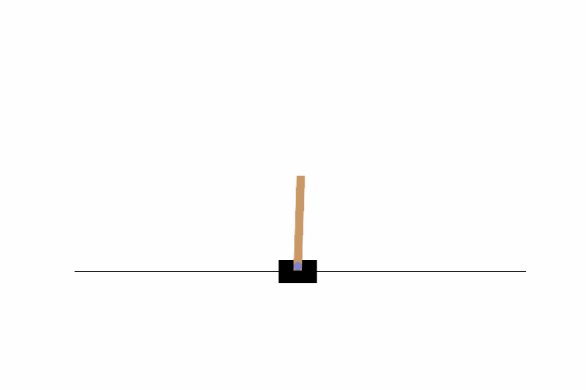

# Deep Q-Network (DQN) - CartPole-v1

This project implements a **Deep Q-Network (DQN)** using **PyTorch** to solve the **CartPole-v1** environment from OpenAI Gym. The goal of the agent is to balance a pole on a moving cart for as long as possible.

## Project Overview

In this project, we build a reinforcement learning agent that learns to balance a pole on a cart by interacting with the environment. The agent is trained using a DQN approach with a neural network to approximate the Q-value function. The project showcases the following key concepts:

### Key Concepts:
- **Deep Q-Network (DQN)**: A reinforcement learning algorithm that uses a neural network to estimate Q-values.
- **Experience Replay**: A technique to store and sample experiences for training to reduce correlations between consecutive actions.
- **Target Network**: A separate network used to calculate stable target Q-values for training.
- **Epsilon-Greedy Policy**: A strategy to balance exploration and exploitation while learning.

## Installation

1. Clone this repository:
    git clone https://github.com/bnikolaos21b/DQN-CartPole.git
    cd DQN-CartPole
    
2. Install the required dependencies
    pip install -r requirements.txt
    
3. Make sure **PyTorch** is installed and you have access to either CPU or GPU (CUDA):
    pip install torch torchvision torchaudio

4. Install OpenAI Gym and CartPole environment:
    pip install gym

## Animation of the Trained Agent

The notebook also generates an animation of the trained agent interacting with the CartPole-v1 environment. The animation is saved as a **GIF** file.

## How to Use the Code

1. **Run the Jupyter Notebook**: Open `DQN_CartPole.ipynb` and run the cells sequentially. The notebook provides a structured explanation of the code, model architecture, and training process.

2. **Save and Visualize the Agent's Performance**: After training, you can visualize the agent's performance by generating an animation (GIF) of the agent in action.

## Future Improvements

- **Double DQN**: Implement Double DQN to reduce overestimation bias.
- **Prioritized Experience Replay**: Use prioritized experience replay to prioritize important experiences for learning.
- **Tune Hyperparameters**: Experiment with different hyperparameters to improve performance further.
