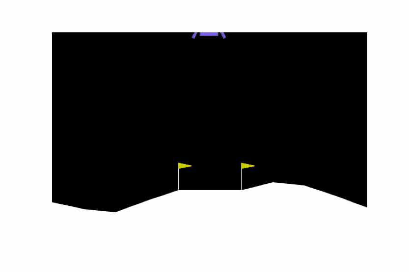

# Deep Q-Network (DQN) with Dueling Architecture - LunarLander-v2

This project implements a **Dueling Deep Q-Network (DQN)** using **PyTorch** to solve the **LunarLander-v2** environment from OpenAI Gym. The agent is trained to land a spacecraft safely on a platform while optimizing fuel usage.

## Project Overview

In this project, we build an agent that uses reinforcement learning to navigate the LunarLander-v2 environment. The agent is trained using a Dueling Q-Network, which splits the estimation of state-value and advantage to improve learning efficiency. The goal is to train the agent to land the spacecraft smoothly while minimizing fuel usage.

### Key Concepts:
- **Deep Q-Network (DQN)**: A type of reinforcement learning algorithm where the agent learns to take the best action based on a learned Q-value function.
- **Dueling Q-Network**: A variant of DQN that separately estimates the state-value and the action advantages, leading to better learning performance.
- **Experience Replay**: A memory buffer that stores past experiences and samples mini-batches of experiences for training, reducing correlation between consecutive samples.
- **Target Network**: A second Q-network that stabilizes training by providing fixed Q-targets for a number of steps before being updated.

## Installation

1. Clone this repository:
    git clone https://github.com/bnikolaos21b/DQN-LunarLander.git
    cd DQN-LunarLander

2. Install the required dependencies:
    pip install -r requirements.txt

3. Make sure **PyTorch** is installed and you have access to either CPU or GPU (CUDA):
    pip install torch torchvision torchaudio

4. Install OpenAI Gym and LunarLander-v2 environment:
    pip install gym[box2d]

## Animation of the Trained Agent

After training, the notebook also provides code to visualize the agent's performance. The agent interacts with the environment, and its actions are recorded in a **GIF** animation or an **MP4** video.

The animation is saved as `lunar_lander.gif` or `lunar_lander.mp4` in the project folder.

